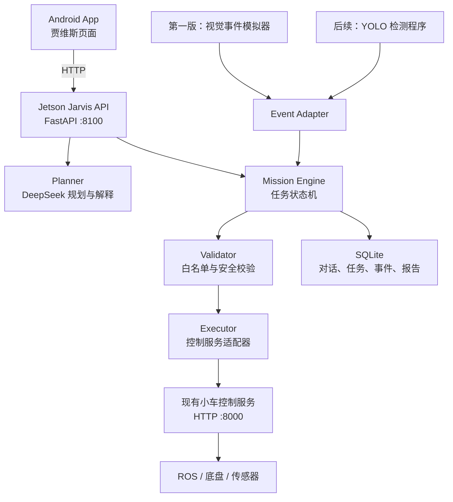

# 贾维斯多模态巡检智能体设计

## 1. 目标

在 Jetson 上部署名为“贾维斯”的智能体服务，将 Android App 的自然语言交互、DeepSeek 的任务规划、ROS 任务执行以及未来 YOLO 视觉检测连接成完整巡检闭环。

第一版使用模拟视觉事件完成端到端演示。YOLO 模型训练完成后，只替换事件来源，不重写智能体、App 或报告模块。

## 2. 设计原则

- DeepSeek 负责目标理解、任务规划、异常解释、对话和报告生成。
- YOLO 负责实时目标检测、分类和追踪。
- ROS 负责实时运动、导航、避障和设备控制。
- 贾维斯只编排白名单能力，不直接生成轮速或持续驾驶指令。
- 急停、碰撞风险和底层安全逻辑不依赖 LLM，也不等待网络响应。
- 所有可能改变小车运行状态的 LLM 计划必须经过本地校验；关键操作必须由用户确认。

## 3. 总体架构



贾维斯服务使用独立端口 `8100`，不把智能体逻辑直接写入现有 `8000` 控制服务。这样可以独立重启、测试和升级智能体，同时保持底盘控制接口稳定。

## 4. 组件职责

### 4.1 Jarvis API

提供 Android App 使用的版本化接口：

- `POST /api/v1/chat`：提交自然语言目标或追问。
- `POST /api/v1/missions`：根据已生成计划创建任务。
- `POST /api/v1/missions/{id}/confirm`：确认并开始执行。
- `POST /api/v1/missions/{id}/cancel`：取消任务。
- `POST /api/v1/missions/{id}/decisions`：提交绕行、忽略、暂停等用户处理决定。
- `GET /api/v1/missions/{id}`：查询任务、步骤和最新状态。
- `GET /api/v1/missions/{id}/timeline`：读取任务时间线。
- `POST /api/v1/events/vision`：接收模拟器或 YOLO 的视觉事件。
- `GET /api/v1/reports/{id}`：读取最终巡检报告。
- `GET /health`：检查贾维斯服务、DeepSeek 配置和控制服务状态。

第一版 Android App 每秒轮询一次运行中任务，不引入 WebSocket 依赖。后续需要多车或大量事件时，再将时间线更新替换为 WebSocket 或 SSE。

除 `/health` 外，接口使用 `JARVIS_APP_TOKEN` 配置的共享访问令牌。令牌保存在 Jetson 环境变量和 Android Keystore 中，不写入源码或 APK 默认配置。

### 4.2 DeepSeek Client

- API Key 只存放在 Jetson 环境变量 `DEEPSEEK_API_KEY` 中。
- API 地址和模型名分别通过 `DEEPSEEK_BASE_URL`、`DEEPSEEK_MODEL` 配置。
- 支持超时、一次重试、响应记录和可诊断的错误返回。
- 不向 DeepSeek 发送高频传感器数据，只发送任务上下文、有效异常事件和结构化状态摘要。

### 4.3 Planner

Planner 要求 DeepSeek 输出符合 JSON Schema 的计划，不允许直接输出 URL、Shell 命令或 ROS 命令。

计划的核心结构为：

```json
{
  "summary": "巡检停车场并重点检查通道障碍",
  "steps": [
    {"action": "CHECK_STATUS", "arguments": {}},
    {"action": "START_TASK", "arguments": {"task": "camera"}},
    {"action": "START_TASK", "arguments": {"task": "avoidance"}},
    {"action": "GENERATE_REPORT", "arguments": {}}
  ],
  "completion_criteria": ["巡检步骤完成", "异常事件已记录"],
  "requires_confirmation": true
}
```

### 4.4 Validator

第一版只允许以下动作：

- `CHECK_STATUS`
- `START_TASK`
- `STOP_TASK`
- `STOP_ALL`
- `RECORD_EVENT`
- `ASK_USER`
- `GENERATE_REPORT`

`START_TASK` 和 `STOP_TASK` 的任务名必须来自服务端白名单。禁止 LLM 使用 `/move`、轮速、任意 URL、Shell 命令或未经注册的 ROS 功能。

### 4.5 Mission Engine

任务状态统一为：

```text
DRAFT -> WAITING_CONFIRMATION -> RUNNING
      -> PAUSED | FAILED | CANCELLED | COMPLETED
```

Mission Engine 负责步骤推进、超时、暂停、取消、恢复检查和时间线记录。服务重启后可从 SQLite 恢复记录，但不会自动重发最后一条控制命令；必须先重新读取控制服务状态。

### 4.6 Event Adapter

统一视觉事件格式：

```json
{
  "source": "simulator",
  "event_type": "obstacle",
  "label": "纸箱",
  "confidence": 0.87,
  "position": "通道中央",
  "track_id": "sim-001",
  "image_path": "/data/jarvis/evidence/event-001.jpg",
  "timestamp": "2026-07-12T14:30:21+08:00",
  "metadata": {}
}
```

第一版模拟器生成纸箱、积水、违停车辆等事件。后续 YOLO 可以直接调用 `POST /api/v1/events/vision`，或由 ROS2 适配器订阅检测话题后转换成相同格式。

Event Adapter 负责类别映射、置信度阈值、重复事件合并和冷却时间。连续视频帧不会直接触发连续的 DeepSeek 请求。

### 4.7 Executor

Executor 只调用现有小车控制服务：

- `/health`
- `/status`
- `/start/{task}`
- `/stop/{task}`
- `/stop/all`
- `/emergency_stop`

Executor 不直接访问电机、串口或底盘驱动。急停仍可以由 Android App 直接调用现有控制服务，避免智能体成为安全链路中的单点故障。

### 4.8 Memory 和报告

SQLite 保存以下实体：

- 对话会话和消息
- 任务、步骤和状态变化
- 视觉事件及证据路径
- 用户确认和处理决定
- Markdown 巡检报告

第一版报告包含任务摘要、执行时间线、异常清单、风险排序、用户处理决定和证据图片路径。报告生成后仍可基于本次任务上下文继续追问。

## 5. Android 交互设计

现有底部弹窗改为独立的“贾维斯”页面，首页保留快捷入口，暂不增加第六个底部导航项。

页面包括：

- 连接状态、当前任务和模型状态。
- 用户与贾维斯的对话区域。
- 待确认的任务计划及修改、确认、取消按钮。
- 实时任务步骤和时间线。
- 异常事件卡片，包括风险、解释、证据和处理操作。
- 固定且易触达的急停按钮。
- 巡检报告入口和基于报告的追问输入框。

App 退出后任务继续在 Jetson 执行。重新进入页面时，App 根据任务 ID 恢复任务状态、对话和时间线。

## 6. 端到端数据流

1. 用户在 App 输入高层目标。
2. Jarvis API 读取控制服务状态和可用任务。
3. Planner 调用 DeepSeek 生成结构化计划。
4. Validator 校验动作、参数和确认要求。
5. App 展示计划，用户确认后创建运行任务。
6. Mission Engine 通过 Executor 启动白名单 ROS 任务。
7. 模拟器或未来 YOLO 向 Event Adapter 发送视觉事件。
8. 本地规则先完成去重和基础风险判断；有意义的新事件才交给 DeepSeek 解释。
9. 普通事件自动记录；改变路线、切换任务等操作请求用户确认；本地安全事件可直接停车。
10. 任务结束后，DeepSeek 根据结构化记录生成报告，用户可以继续追问。

## 7. 故障与安全处理

- DeepSeek 超时后重试一次；仍失败则暂停新的智能体决策，不执行未确认动作。
- DeepSeek 返回非法 JSON 时尝试一次格式修复；仍失败则仅作为文本显示。
- Validator 拒绝所有白名单外动作和越界参数。
- App 断开不终止已确认的 Jetson 任务，重连后同步状态。
- Jetson 失去互联网后停止新的 LLM 推理，但本地 ROS 安全逻辑保持工作。
- 控制服务失联时任务进入 `PAUSED`，不继续下发步骤。
- 碰撞风险和急停不经过 DeepSeek，直接由本地安全链路处理。
- 服务重启后恢复记录但不重放控制命令。
- API Key 未配置时，贾维斯明确显示模型不可用，手动控制保持可用。

## 8. 测试策略

### 8.1 单元测试

- JSON Schema 验证和非法输出拒绝。
- 动作及任务白名单。
- 任务状态转换和重复确认保护。
- 事件去重、置信度阈值和冷却时间。
- DeepSeek 超时、重试和格式修复。

### 8.2 集成测试

使用假的 DeepSeek 服务和假的 `8000` 控制服务验证：

- 从自然语言目标到计划确认、执行和报告的完整闭环。
- 非法动作不能到达 Executor。
- 控制服务失败时后续步骤停止。
- 服务重启后不会重复执行控制动作。

### 8.3 Android 测试

- 对话、计划确认、取消和错误状态。
- 任务时间线轮询和页面恢复。
- 异常卡片操作和报告展示。
- 急停入口在贾维斯服务异常时仍可使用。

### 8.4 实车验收

主验收场景：

1. 用户下达停车场巡检任务。
2. DeepSeek 生成合法计划。
3. 用户确认后 Jetson 启动任务。
4. 模拟器发送纸箱和积水事件。
5. 贾维斯解释风险并请求用户处理决定。
6. 用户确认后任务继续。
7. 系统生成包含时间线和异常证据的巡检报告。

必须同时通过 DeepSeek 不可用、控制服务断开和非法动作输出三个失败场景，且任何失败都不能造成小车失控。

## 9. 分阶段交付

### 阶段一：模拟事件闭环

完成 Jetson 贾维斯服务、DeepSeek 规划、安全校验、任务状态机、Android 独立页面、模拟视觉事件和报告生成。

### 阶段二：YOLO 接入

训练模型输出类别、置信度、位置、追踪 ID 和异常帧，通过统一视觉事件接口替换模拟器。

### 阶段三：真实自主巡检

在经过单独测试的导航或巡检 ROS 任务可用后，将其加入任务白名单，实现真实路线巡检和动态事件处理。

## 10. 非目标

第一版不包含：

- LLM 直接控制轮速或连续驾驶。
- DeepSeek 逐帧分析实时视频。
- 公网云端智能体部署和多车管理。
- 未确认的自动绕行、任务切换或导航目标修改。
- YOLO 模型训练本身。

## 11. 并行开发安排

实施阶段可由多个智能体并行工作：

- Jetson 后端：API、DeepSeek、Planner、Validator、Mission Engine、SQLite 和模拟器。
- Android：贾维斯页面、API 客户端、计划确认、时间线和报告界面。
- 验证与文档：契约测试、失败场景、部署说明和验收脚本。

并行开发前先固定本设计中的 API 和 JSON 契约。主线集成负责解决共享接口变更，并在每个阶段运行完整测试。
